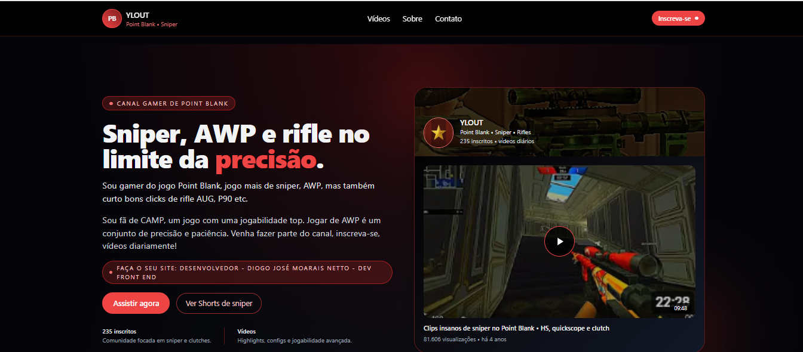

# YLOUT | Divulgação de Canal no YouTube

## 📸 Preview do Projeto

Projeto desenvolvido para **divulgação de um canal no YouTube**, com foco em apresentação visual clara, chamada para ação e identidade digital forte.  
O site já está **em uso real por um cliente**, cumprindo o objetivo de fortalecer a presença online do canal.

---

## 🎯 Objetivo do Projeto
Criar uma página simples, moderna e responsiva para:
- Apresentar o canal no YouTube  
- Direcionar o público para os vídeos  
- Fortalecer a identidade visual do criador de conteúdo  
- Facilitar o acesso em dispositivos móveis  

---

## 👨‍💻 Desenvolvedor
Projeto desenvolvido por **Diogo José Morais Netto**, desenvolvedor **Front-End**, com foco em criação de sites, landing pages e interfaces responsivas voltadas para clientes reais.

---

## 🚀 Tecnologias utilizadas
- HTML5  
- CSS3  
- JavaScript  
- Bootstrap  
- Tailwind CSS  
- Git e GitHub  

---

## 📱 Características do Projeto
- Layout responsivo  
- Design limpo e direto  
- Foco em experiência do usuário  
- Projeto real em produção

# Clone o repositório
git clone https://github.com/Diogo-netto/YLOUT.git 

